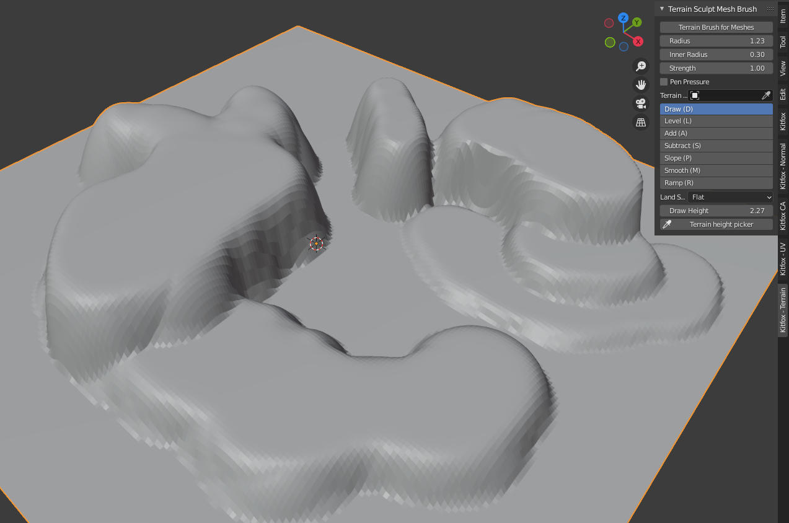
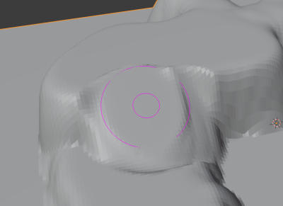
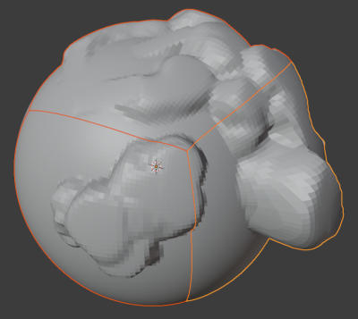

# Terrain Sculpting Tool for Blender

A tool for sculpting in Blender with a focus on terrain.  Blender's default sculpting tools are great for character models, but are difficult to use when you're trying to sculpt terrain.  This tool suite provides options for leveling ground, creating ramps and constraining your changes to be perpendicular to the ground.  It's meant to allow you to quickly block in a terrain in the early stages of your project.

These tools can be accessed through the **Kitfox - Terrain** panel on the right of the 3D Viewport.  You can also access them from the uv unwrap menu (press U while in edit mode).

### Basic usage

Start by creating the mesh for your terrain (for example, a grid mesh that is 100 x 100 units).  Make sure you are in Object mode.  Select the object and click the **Terrain Brush for Meshes** button in the **Terrain Sculpt Mesh Brush** panel.  The tool will start and a pink circle will appear under your mouse cursor.  Click and drag on the mesh to sculpt your terrain.

The tool will also work if you have multiple mesh objects selected.  This can be used to create seamless transitions between two meshes.

You might find that this tool is a bit laggy on larger meshes.  The way to deal with that is to subdivide your mesh into smaller pieces.  This way the brush only has to recalculate the mesh that is actually under the brush.  If you need to draw over the seam between two meshes, just make sure that all meshes you want to draw on are selected before you start the tool.

### Terrain Sculpt Mesh Brush

Use sculpting tools to move vertices to create landscapes.

#### Terrain Brush for Meshes
Start the UV Brush tool.  Pressing **Enter** will commit your changes, **ESC** will cancel your changes.  You can press **Ctrl-Z** to undo a stroke or **Shift-Z** to redo a stroke.  

You will be unable to use the menu panel while the tool is active (this is a current limitation of Blender) - however, there are a number of keyboard shortcuts you can use to adjust to tool while it is running.

#### Radius
Radius of brush stroke.  You can press the **[** and **]** keys to change the radius of the brush.

#### Inner Radius
Used to adjust the hardness of the brush.  The space between the outer and inner radius provides a falloff region for your stroke.  You can press the **Shift-[** and **Shift-]** keys to change the inner radius of the brush.

#### Radius Relative to View

When checked, the brush will automatically adjust it's size in proportion to how far away it is from the viewer, the same way the sculpting brushes do.  Otherwise, the brush will have a fixed size no matter how far from the camera the cursor is.

#### Strength
Multiplier for the strength of your brush stroke.

#### Pen Pressure
If checked, the pressure you apply with your stylus will multiply the strength of your brush.

#### Terrain Origin
By default, the brushes use the world origin as the reference point for all measurements.  However, if you would like to choose a different world center, you can specify it here.  This is mostly useful for **Sphere** mode where you would like the center of your world to be in the middle of the mesh you are sculpting.

#### Brush Type

Select the behavior of the brush you are drawing with.  You can press and hold **Shift** at any time to temporarily switch into Smooth mode.

##### Draw

Shortcut **D**.

Draws terrain under the brush up to the current **Draw Height**.  This can be used to create a terraced landscape.  Press and hold **Ctrl** to temporarily change the draw brush into the height picker.  This can be used to quickly set a new height for your terraces.  The **Up Arrow** and **Down Arrow** keys can be used to add and subtract a quarter of the brush radius to the terrain height.

##### Level

Shortcut **L**.

Same as Draw, but uses the height of the terrain where you start your brush stroke rather than referring to the **Draw Height**.

##### Add

Shortcut **A**.

Brush strokes will build up on top of existing geometry.  Press and hold **Ctrl** to temporarily switch to Subtract mode.

##### Subtract

Shortcut **S**.

Brush strokes will dig trenches in existing geometry.  Press and hold **Ctrl** to temporarily switch to Add mode.

##### Slope

Shortcut **P**.

Calculates the average slope under the cursor and uses that sloping plane to even out the vertices under it.

##### Smooth

Shortcut **M**.

Calculates the average height under the cursor and then uses that height to draw a level surface.

##### Ramp

Shortcut **R**.

Click and drag from one location to another to create a ramp between those locations.  

#### Land Shape

Allows you to switch between Flat and Sphere mode.  Flat mode presumes a flat work where down is always in the negative Z direction.  Sphere mode is used for drawing on spheres for planet like terrains.  In Sphere mode, is always the **Terrain Origin** if you have set is, or the world origin if you have not.

#### Draw Height

In Draw mode, specifies the height above the world origin terrain will be drawn at in Draw mode.

#### Terrain Height Picker

Used to pick the terrain height be sampling your scene.  Click the button to start the tool and then click a mesh in the viewport to set the new drawing height.

#### Add Amount

In Add and Subtract modes, a multiplier that modifies how much is added to subtracted when stroking the brush.

#### Ramp Width

In Ramp mode, indicates how wide the ramp you are drawing will be.

#### Ramp Falloff

In Ramp mode, indicates how much rounding will be applied to the edges of your ramp.

#### Use Slope Angle

By default, the slope tool will try to guess the slope by sampling the slope of the current area under the cursor.  If this is checked, you can specify a specific slope for the brush to draw at.  (The brush will still sample the area under the cursor to determine the directon the slope should face.)

#### Slope Angle

Angle the slope brush will draw at.

## Building

To build, execute the *makeDeploy.py* script in the root of the project.  It will create a directory called *deploy* that contains a zip file containing the addon.

## Installation

To install, start Blender and select Edit > Preferences from the menubar.  Select the Add-ons tab and then press the Install button.  Browse to the .zip file that you built and select it.  Finally, tick the checkbox next to Add Mesh: Terrain Sculpting Tools.

## Further Information

This addon is available at the Blender market:
https://github.com/blackears/blenderTerrainSculpt

A video giving a quick tour of the addon is available here:

